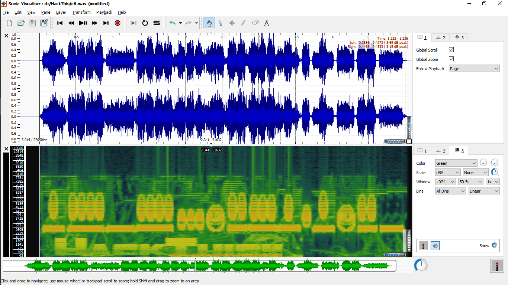

https://www.hackthis.co.uk/levels/crypt/6

>Have a listen to this [file](Resources/c6.wav) and see what you can find.

We got an audio file.

It looks like to find flag in sound waves. I opened this file in sonic vaisualiser.

<tt>pane > Add Spectrogram</tt>

I found a [Maya](https://en.wikipedia.org/wiki/Maya_numerals) text.

Converting to maya numerals: 
>69593078616075

It looks like decimal but it does not. It must be decrypted in hex. Maya's hexadecimal will not exceed 9 because 9 is max in numerals.

Change hex to ascii code: <tt>iY0xa`u</tt>

