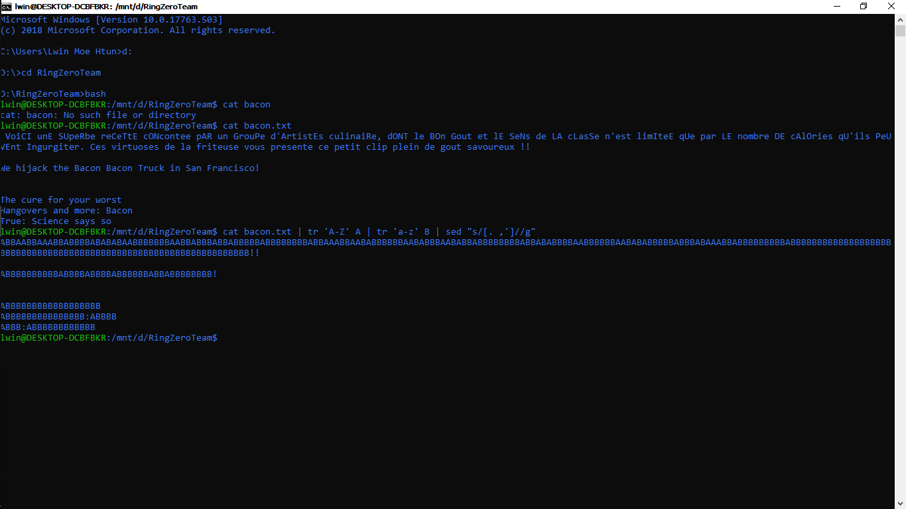

https://ringzer0ctf.com/challenges/114

```
VoiCI unE SUpeRbe reCeTtE cONcontee pAR un GrouPe d'ArtistEs culinaiRe, dONT le BOn Gout et lE SeNs de LA cLasSe n'est limIteE qUe par LE nombre DE cAlOries qU'ils PeUVEnt Ingurgiter. Ces virtuoses de la friteuse vous presente ce petit clip plein de gout savoureux !!

We hijack the Bacon Bacon Truck in San Francisco!


The cure for your worst
Hangovers and more: Bacon
True: Science says so
```
I saved the msg in bacon.txt

The message was composed with Capital & Small letters. It can be assume as two types of letter. The cipher that uses two types of letter is baconian cipher.

Ahh! of course, bacon is described as hint.

Usual one may be <tt>AABBBABBABABAB...</tt>

So, let's change to it:

Let's assume Capital letter as <tt>A</tt> and Small letter as </tt>B</tt>. Ignore(remove) <tt>spaces</tt>, <tt>.</tt>, <tt>,</tt>, <tt>'</tt>, <tt>!</tt>

Here we go!



