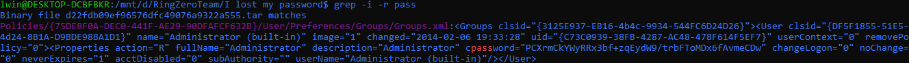

https://ringzer0ctf.com/challenges/51

>[Download archive]()

I extracted the tar file and searched password in folders as follows: 

$ grep -i -r pass

And I found cpassword.

<tt>cpassword="PCXrmCkYWyRRx3bf+zqEydW9/trbFToMDx6fAvmeCDw"</tt>

>Google: cPassword is the name of the attribute that stores passwords in a Group Policy Preference item.

So, use gpp decrypt.

If you are using kali, there is gpp-decrypt tool.

But, in Ubantu, I used a [ruby file](Resources/gppDecrypt.rb) to decrypt it.

Flag: <tt>LocalRoot!</tt>

