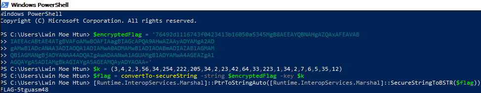

At first, I thought it was base 64 but didn't work.
So, I google secure string.
I found some [solutions](https://docs.microsoft.com/en-us/powershell/module/microsoft.powershell.security/convertto-securestring?view=powershell-6).

Open powershell:

Then, got the flag.

>FLAG-5tguasm48
